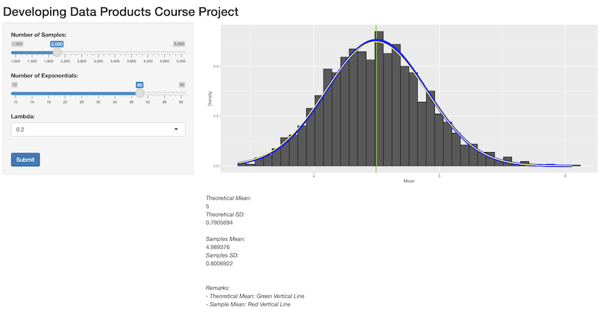

```{r setup, include=FALSE}
knitr::opts_chunk$set(echo = FALSE)
```

## Overview

This Shiny App allows user to experience the exponential distribution and to compare with the Central Limited Theorem with corresponding numbers of samples, number of exponentials and Lambda.


## sadfsa

- Bullet 1
- Bullet 2
- Bullet 3

## Output



## Shiny App and Source Codes URLs

- [Shiny Application at shinyapps.io](https://hwongcy.shinyapps.io/Develop_Data_Products_Course_Project/)

- [Source Codes at GitHub](https://github.com/hwongcy/Developing_Data_Products_Course_Project/tree/main/Develop_Data_Products_Course_Project)

